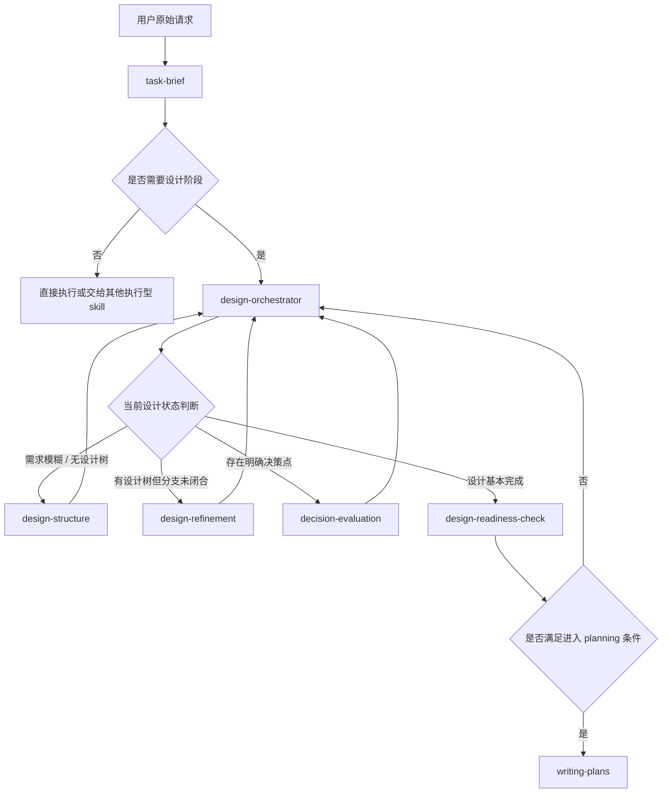

# 背景与决策 (Background and Decisions)

当前仓库中的 `brainstorming` 技能承担了过多职责：需求澄清、设计拆分、方案比较、设计文档输出与进入 `writing-plans` 的 handoff（交接）都混在同一个技能里。结果是触发语义过宽、设计拆分粒度不稳定、不同设计阶段之间缺少清晰边界。

本设计将该单体技能拆分为一组职责清晰的设计技能，并引入一个轻量级编排器（orchestrator）负责流程判断与 handoff。

已确认决策如下：

- 正式采用多技能（multi-skill）体系，不再把 `brainstorming` 作为有效技能入口。
- 采用 `4 个设计子技能 + 1 个 design-orchestrator` 的结构，而不是纯 4 子技能。
- `task-brief` 仅作为上游入口，不承担设计阶段编排职责。
- 新技能命名固定为：
  - `design-orchestrator`
  - `design-structure`
  - `design-refinement`
  - `decision-evaluation`
  - `design-readiness-check`
- `brainstorming` 目录暂时保留，但标记为已停用（inactive）。

# 目标与非目标 (Goals and Non-Goals)

## 目标 (Goals)

- 将设计工作拆分为可独立触发、可稳定协同的技能。
- 让设计阶段围绕设计树（design tree）推进，而不是围绕松散章节推进。
- 提高设计稿的完成度、边界清晰度与进入 `writing-plans` 前的可用性。
- 明确设计阶段的质量门禁（quality gate），避免在设计不完整时提前进入实现规划。

## 非目标 (Non-Goals)

- 本次改造不处理实现类技能的整体重构。
- 本次改造不删除 `skills/brainstorming/` 目录。
- 本次改造不覆盖外部设计文档审计能力；该职责仍由 `design-decision-audit` 承担。

# 总体架构 (System Topology)

新流程如下：

该结构的核心差异在于：

- `task-brief` 只负责任务归一化（task normalization）与是否进入设计阶段的初步判断。
- `design-orchestrator` 只负责设计阶段的路由，不承担深度设计。
- 4 个子技能分别负责建树、补树、选枝、验树。

# 技能职责定义 (Skill Responsibilities)

## 设计编排器 (design-orchestrator)

负责读取当前设计状态（design state），判断现在更适合进入哪一个设计子技能。它不直接做深度设计，只负责流程控制、回流判断与最终进入 `writing-plans` 的放行。

## 设计结构化 (design-structure)

负责从模糊需求中建立初始设计树，明确目标（goal）、范围（scope）、边界（boundaries）、核心对象（core objects）、关键流程（core flows）与决策点（decision nodes）。

## 设计细化 (design-refinement)

负责沿设计树逐分支推进，将粗粒度节点细化到可实现叶子节点（implementable leaf node）。它重点补齐职责边界、失败路径、验证方式与关键依赖。

## 决策评估 (decision-evaluation)

负责对明确决策点做候选方案比较，并输出推荐方案、权衡（trade-off）与放弃其他方案的理由。它只处理有边界的设计选择题，不承担全局设计发现。

## 设计就绪检查 (design-readiness-check)

负责在进入 `writing-plans` 之前检查当前设计是否足够完整。它关注空分支、弱叶子节点、隐含假设、未解决风险、失败处理与验证策略是否缺失，并输出明确的 `ready_for_planning` 结论。

# 协同契约 (Coordination Contract)

所有设计技能围绕统一的 `design_state` 工作。建议最小字段集如下：

- `problem`
- `scope`
- `design_tree`
- `open_branches`
- `decision_nodes`
- `decisions`
- `risks`
- `validation`
- `status`

字段分工如下：

- `design-structure` 主要初始化 `problem`、`scope`、`design_tree`、`open_branches`、`decision_nodes`
- `design-refinement` 主要补充 `design_tree`、`open_branches`、`risks`、`validation`
- `decision-evaluation` 主要更新 `decision_nodes`、`decisions`、`risks`
- `design-readiness-check` 主要判断 `status.ready_for_planning` 与 `status.blocking_issues`
- `design-orchestrator` 主要读取全体状态并调整 `status.phase`

这份契约的目的不是引入严格 schema（模式）约束，而是避免多个技能之间的 handoff 丢失关键状态。

# 为什么选择 4+1 (Why 4+1 Instead of Plain 4)

选择 `4 个设计子技能 + 1 个 design-orchestrator` 的原因是：纯 4 子技能缺少一个稳定的流程判断层。没有编排器时，会出现以下问题：

- 没有人负责判断当前是该继续建树，还是该进入方案比较。
- 没有人负责在 `decision-evaluation` 之后决定是否回流到 `design-refinement`。
- 没有人负责在设计看起来“差不多”时判断是否应进入 `design-readiness-check`。
- 子技能之间容易互相侵入职责边界。

引入 `design-orchestrator` 后，深度设计与流程判断被拆开，系统更稳定，也更容易写清楚触发描述（description）。

# 与现有技能的关系 (Relationship to Existing Skills)

## 与 task-brief 的关系 (Relationship to task-brief)

`task-brief` 是上游入口。它负责把原始请求压缩为结构化任务简报，并初步判断是否需要进入设计阶段。它不负责设计树构建、设计阶段编排或设计完备性检查。

推荐关系如下：

`task-brief -> design-orchestrator -> design sub-skills`

## 与 design-decision-audit 的关系 (Relationship to design-decision-audit)

`design-decision-audit` 负责审查设计文档（design document）或计划文档（plan document）中的缺失决策与上线风险。

`design-readiness-check` 负责检查当前设计流程里的设计状态是否可进入 `writing-plans`。

两者都属于“检查”，但检查对象不同：

- `design-decision-audit` 面向文档审计（document audit）
- `design-readiness-check` 面向流程门禁（process gate）

# brainstorming 处置方案 (Brainstorming Disposition)

`brainstorming` 将被标记为已停用（inactive），不再作为有效技能入口。目录暂时保留，原因如下：

- 迁移期间保留历史上下文，便于对照旧逻辑。
- 避免在同一轮改造中同时做大规模删除。
- 便于后续决定是否彻底清理相关评测（eval）和遗留文件。

为避免继续触发，`skills/brainstorming/SKILL.md` 需要显式声明它已被新体系替代，并指向 `design-orchestrator` 作为新入口。

# 迁移范围 (Migration Scope)

本次迁移至少应覆盖以下文件：

- `README.md`
- `README.zh-CN.md`
- `docs/skills/workflow.md`
- `skills/task-brief/SKILL.md`
- `skills/writing-plans/SKILL.md`
- `skills/using-git-worktrees/SKILL.md`
- `skills/brainstorming/SKILL.md`
- 新增的 5 个技能目录与 `SKILL.md`

若后续发现其他显式引用 `brainstorming` 的文件，应一并迁移。

# 风险与缓解 (Risks and Mitigations)

## 风险 (Risks)

- 新旧技能共存一段时间，容易造成认知偏差。
- 新技能名称虽然统一，但触发描述仍需靠评测（eval）继续校准。
- 如果不把 `design_state` 作为共享契约写进技能正文，多个技能之间仍可能出现状态漂移。

## 缓解 (Mitigations)

- 在文档层面只宣传新体系，不再把 `brainstorming` 作为有效入口。
- 为每个技能写清楚进入条件、退出条件与 handoff 规则。
- 在后续迭代中补充新技能的评测（eval）与描述优化。

# 落地顺序 (Rollout Plan)

建议按以下顺序落地：

1. 新建 5 个设计技能并完成基础正文。
2. 更新文档与技能引用，切换到新体系。
3. 将 `brainstorming` 标记为已停用。
4. 运行一致性检查，确认仓库内不再把 `brainstorming` 当作有效入口。
5. 后续再处理评测（eval）迁移与目录清理。

# 开放问题 (Open Questions)

当前仍可后续迭代的问题有：

- 是否为 5 个新技能补独立评测（eval）目录。
- 是否将 `design_state` 进一步正式化为固定输出模板。
- 是否在后续版本中彻底删除 `skills/brainstorming/`。
