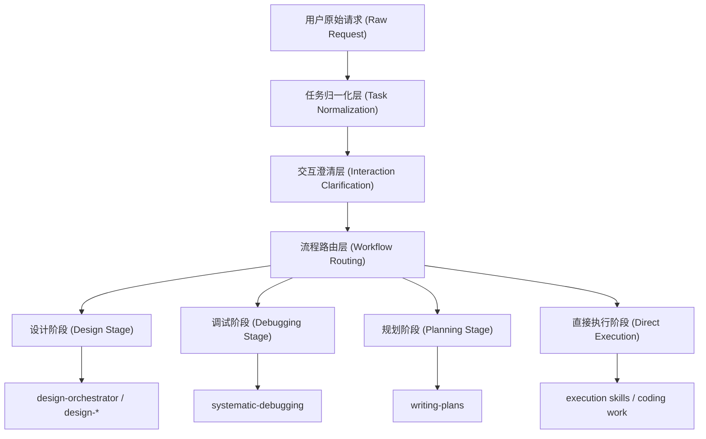

# 任务入口与路由分层设计决策草案 (Task Intake and Routing Architecture Decision Draft)

> **状态 (Status):** 草案（draft）。
>
> 本文档记录的是目标架构（target architecture）与设计决策（design decisions），不是已经全面生效的实现规范（implementation standard）。

## 背景与问题 (Background and Problem)

在当前技能体系里，任务入口（task intake）、澄清（clarification）、路由（routing）与阶段执行（stage execution）容易被混写在同一个 skill 中。最典型的问题是：

- `task-brief` 容易被继续扩张成工作流总控
- `design-orchestrator` 容易被误读为全局路由器
- “复杂任务”容易被直接等同为“设计任务”
- 提问（questioning）容易从交互策略（interaction policy）滑成一个含糊的独立流程层

这会带来三个后果：

- 技能边界变宽，触发语义越来越不稳定
- 上下游 handoff（交接）逐渐依赖隐含约定，而不是清楚的抽象边界
- 设计、调试、规划和直接执行之间缺少稳定分层，后续实现容易再次耦合

本草案的目的，是先把目标分层说清楚，再决定后续是否需要新增独立的全局流程路由 skill。

## 本次决策 (Decision)

本草案选择把任务处理过程拆成四层抽象，而不是继续让入口 skill 同时承担归一化、提问、路由和执行控制。

四层分别是：

1. 任务归一化层（Task Normalization）
2. 交互澄清层（Interaction Clarification）
3. 流程路由层（Workflow Routing）
4. 阶段执行层（Stage Execution）

这个决策的核心不是新增更多字段，而是把“内容产出”和“流程控制”拆开。

## 四层抽象 (Four-Layer Abstraction)

这四层分别回答不同问题：

- 任务归一化层（Task Normalization）
  - 这到底是什么任务
  - 用户真正想要什么结果
  - 完成标准（success criteria）与关键边界（constraints）是什么

- 交互澄清层（Interaction Clarification）
  - 当前这一轮是否值得提问
  - 如果要问，哪一个问题最值得先问
  - 哪些未决项（outstanding unknowns）暂时只记录，不升级成当轮提问

- 流程路由层（Workflow Routing）
  - 这个任务下一步更适合进入设计（design）、调试（debugging）、规划（planning）还是直接执行（direct execution）

- 阶段执行层（Stage Execution）
  - 进入对应阶段后，由专门技能继续推进

## 技能定位 (Skill Positioning)

当前相关技能在目标分层中的位置，按本草案理解如下：

| 技能 | 目标位置 | 本草案赋予的主要职责 | 本草案刻意不让它负责的事情 |
|------|----------|----------------------|-----------------------------|
| `task-brief` | 任务归一化层（Task Normalization），少量接触交互澄清层（Interaction Clarification） | 产出任务简报（task brief），提炼目标、成功标准、约束、假设，并做轻量的 `Needs Design` 判断 | 全局流程路由、设计技能路由、子任务拆解、实现规划 |
| `workflow-router`（拟新增，planned） | 流程路由层（Workflow Routing） | 读取已归一化的任务简报，并判断下一阶段 | 重写任务目标、承担多轮澄清、替下游完成实际工作 |
| `design-orchestrator` | 设计阶段内部路由 | 在设计阶段内部决定下一步更适合哪个设计 skill | 全局任务分发、调试、规划、深度设计 |
| `design-structure` | 设计阶段（Design Stage） | 建立初始设计树（design tree） | 全局路由、实现计划、直接执行 |
| `design-refinement` | 设计阶段（Design Stage） | 细化已有设计树 | 初始建树、全局路由、实现计划 |
| `decision-evaluation` | 设计阶段（Design Stage） | 处理单个明确决策点的方案比较 | 广义任务澄清、全局路由、完整设计发现 |
| `design-readiness-check` | 设计阶段（Design Stage） | 判断设计是否足以进入 `writing-plans` | 继续做设计细化、实现计划撰写、直接执行 |
| `systematic-debugging` | 调试阶段（Debugging Stage） | 先做根因调查（root-cause investigation），再进入修复 | 设计树构建、实现规划 |
| `writing-plans` | 规划阶段（Planning Stage） | 把稳定目标或稳定设计转成实施计划（implementation plan） | 上游任务归一化、全局路由、直接编码 |
| `executing-plans` / `subagent-driven-development` / `finishing-a-development-branch` | 下游执行链路 | 执行、集成、收尾 | 补上游抽象缺口 |

## 关键判断 (Key Judgments)

### 1. `task-brief` 是入口，不是工作流总控 (Intake, Not Workflow Control)

本草案保留 `task-brief` 作为入口 skill，但刻意不把它继续扩张成工作流总控。

原因很简单：

- 它最擅长的是把原始请求压缩成稳定 brief
- 它不适合同时承担路由、拆解、规划和迁移排序
- 一旦把这些职责塞回去，入口层又会重新膨胀

### 2. 提问首先是交互策略，不是默认独立 skill (Questioning Is Policy First)

本草案不把澄清（clarification）直接设计成一个默认独立 skill。

当前判断是：

- 提问更像各 skill 内部的交互控制逻辑
- 每轮优先只问一个最高杠杆问题
- 允许存在多个未决项，但不要求全部升格为当轮问题

也就是说，本草案承认“交互澄清层”这个抽象存在，但并不预设它必须落地成一个单独 skill。

### 3. 复杂任务不自动等于设计任务 (Complex Does Not Automatically Mean Design)

复杂（complex）只说明任务不够直接，不说明它天然属于设计阶段。

本草案刻意做这层区分：

- 复杂但偏根因调查的任务，更接近 `systematic-debugging`
- 复杂但目标已稳定、只差实施拆解的任务，更接近 `writing-plans`
- 只有确实需要设计树（design tree）、设计分支细化或明确决策比较时，才进入设计链路

### 4. 设计阶段内部路由与全局路由分开 (Design Routing Is Not Global Routing)

本草案保留 `design-orchestrator`，但只把它定位成设计阶段内部路由器。

这是一条刻意的架构切分：

- `design-orchestrator` 负责在设计阶段内部决定下一步是 `design-structure`、`design-refinement`、`decision-evaluation` 还是 `design-readiness-check`
- 它不负责判断任务是否应该进入调试、规划或直接执行

因此，本草案倾向于后续新增一个独立的 `workflow-router`，而不是继续把更多全局职责塞给 `task-brief` 或 `design-orchestrator`。

### 5. 初始设计树落盘是 repo-local 决策 (Initial Design-Tree Persistence Is Repo-Local)

本草案保留一个仓库内的本地决策（repo-local decision）：`design-structure` 产出的权威设计工件（authoritative design artifact）在首次达到“可稳定引用（stable-to-reference）”门槛后，落到 `docs/design-tree/`。

这个决定的作用不是给整个 design-tree family 定共享协议，而是解决本仓库里的 handoff 问题，避免：

- 设计阶段交接时找不到权威文件
- 设计树散落在多个目录
- 同一条设计谱系不断长出 `v2`、`final`、`new` 之类的续写文件

## 目标态接口草图 (Proposed Target-State Interfaces)

下面这些内容是目标态接口草图（proposed target-state interfaces），用于说明后续 `workflow-router` 如果落地，大致会消费什么、产出什么。它们是设计方向，不是当前已经全面生效的稳定协议。

### `task-brief` -> `workflow-router`

如果后续新增 `workflow-router`，本草案倾向于让它主要消费这些稳定字段：

- `Task Type`
- `User Goal`
- `Success Criteria`
- `Deliverables`
- `Constraints`
- `Assumptions`
- `Needs Design`
- `Clarifying Question`（若存在）

对应地，本草案不希望 `task-brief` 被重新拉回去产出：

- 子任务拆解（sub-task decomposition）
- 执行模式（execution mode）
- 依赖图（dependency graph / DAG）
- 实现计划（implementation plan）
- 迁移顺序（migration sequence）

### `workflow-router` -> 阶段执行层

如果 `workflow-router` 存在，它更像是返回一个小而清楚的判定，而不是长篇分析。

本草案预期它至少会表达：

- `route`
- `route_reason`
- `blocking_unknowns`
- `next_skill_family`

这里的重点不是字段名本身，而是路由层只做“下一阶段判断”，不顺带生成下游正文。

### 路由结果的目标表达 (Intended Route Expression)

本草案当前偏好的 `route` 枚举值只有四个：

- `design`
- `debugging`
- `planning`
- `direct_execution`

这个枚举的目的，是让后续实现更容易评测（eval）和比较，而不是让文档提前冻结所有细节。

## 现状与目标态 (Current State and Target State)

当前仓库的现状与本草案的目标态并不完全一致。

现状大致是：

- `task-brief` 已经开始向任务归一化层收敛
- `design-orchestrator` 仍是已存在的设计阶段内部路由器
- 全局流程路由层（Workflow Routing）目前没有独立 skill 承接

因此，这份文档应被理解为：

- 它描述了目标边界（target boundaries）
- 它解释了为什么要这样分层
- 它给出了后续实现收敛的方向
- 它不是“所有相关 skill 已经完成迁移”的现状说明

## 过渡期含义 (Transitional Implications)

在 `workflow-router` 真正落地之前，本草案对过渡期的理解是：

- 当前设计链路仍然是 `task-brief -> design-orchestrator -> design-*`
- 这并不意味着 `design-orchestrator` 应被视为全局路由器
- 非设计任务仍继续使用现有 workflow 或相关执行型 skill
- 过渡期可以暂时接受“全局流程路由尚未独立实现”这一事实
- 但不应因此重新把上游职责塞回 `task-brief` 或 `design-orchestrator`

换句话说，本草案试图约束的是“架构收敛方向”，而不是把当前所有缺口假装成已经解决。

## 反模式与被拒绝方案 (Anti-Patterns and Rejected Alternatives)

本草案明确反对下面几种方向：

- 让 `task-brief` 同时产出 brief、执行模式（execution mode）和子任务拆解
- 让 `design-orchestrator` 承担调试、规划或通用任务分发
- 把“这一轮问什么”直接等同于“任务协议里只能表达什么”
- 看到复杂请求就默认送进设计链路

这些做法的问题，不是它们一定立刻出错，而是它们会持续侵蚀分层。

## 路由判例矩阵 (Routing Example Matrix)

为了让这个架构决策更容易讨论，下面给出一组最小判例。它们用于说明本草案的判断倾向，不是正式规范测试集。

| 用户请求类型 | 本草案倾向的下一步 | 原因 |
|--------------|--------------------|------|
| “这个接口最近偶发超时，帮我查根因。” | `debugging` | 真实目标是根因调查 |
| “把现有支付模块迁到事件驱动架构，先帮我梳理要设计哪些东西。” | `design` | 明显需要设计树与设计决策 |
| “设计稿已经定了，帮我拆成实施计划和里程碑。” | `planning` | 上游目标基本稳定，当前缺的是实施拆解 |
| “把这个函数重命名并修掉对应测试。” | `direct_execution` | 目标和范围都清楚 |
| “我想给 API 加 Redis，先帮我理清到底要改什么。” | 先经 `task-brief` 重新归一化 | 用户说的是方案，不一定是真实目标 |
| “我想做导出中心，但先没想好是系统、工作流还是方法论。” | `design` | 设计目标类型（design target type）尚未稳定 |

## 开放问题 (Open Questions)

这份草案仍有几个后续问题没有在本文里彻底定死：

- `workflow-router` 是否真的需要作为独立 skill 落地
- 路由判定结果是否最终会固化成稳定协议字段
- 回流（re-entry）与重判（re-routing）逻辑，是写成共享约定，还是分散在各 skill 内部
- 这份设计决策里，哪些内容最终应沉淀为 `docs/standards/` 下的长期规范

## 当前结论 (Current Conclusion)

本草案的结论很集中：

- `task-brief` 是任务入口，不是工作流总控
- 全局流程路由层最好独立出来，而不是继续塞进已有 skill
- `Clarifying Question` 更接近交互策略，而不是完整流程层
- `Needs Design` 是轻量判断，不等于设计阶段内部路由
- `design-orchestrator` 只负责设计阶段内部路由

如果后续实现要偏离这些结论，最好先更新这份设计决策，而不是在单个 skill 里悄悄改写边界。
