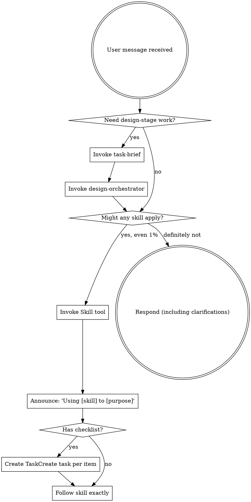

# Skill Invocation Workflow

Describes the decision flow for invoking skills in response to user messages.

```dot
digraph skill_flow {
    "User message received" [shape=doublecircle];
    "Need design-stage work?" [shape=diamond];
    "Invoke task-brief" [shape=box];
    "Invoke design-orchestrator" [shape=box];
    "Might any skill apply?" [shape=diamond];
    "Invoke Skill tool" [shape=box];
    "Announce: 'Using [skill] to [purpose]'" [shape=box];
    "Has checklist?" [shape=diamond];
    "Create TaskCreate task per item" [shape=box];
    "Follow skill exactly" [shape=box];
    "Respond (including clarifications)" [shape=doublecircle];

    "User message received" -> "Need design-stage work?";
    "Need design-stage work?" -> "Invoke task-brief" [label="yes"];
    "Invoke task-brief" -> "Invoke design-orchestrator";
    "Invoke design-orchestrator" -> "Might any skill apply?";
    "Need design-stage work?" -> "Might any skill apply?" [label="no"];
    "Might any skill apply?" -> "Invoke Skill tool" [label="yes, even 1%"];
    "Might any skill apply?" -> "Respond (including clarifications)" [label="definitely not"];
    "Invoke Skill tool" -> "Announce: 'Using [skill] to [purpose]'";
    "Announce: 'Using [skill] to [purpose]'" -> "Has checklist?";
    "Has checklist?" -> "Create TaskCreate task per item" [label="yes"];
    "Has checklist?" -> "Follow skill exactly" [label="no"];
    "Create TaskCreate task per item" -> "Follow skill exactly";
}
```
