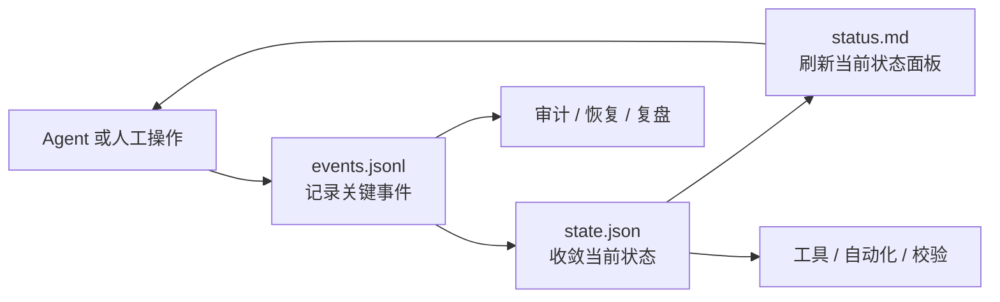

# 任务状态管理规范 (Task State Management Specification)

> 状态（Status）：草案（Draft）
>
> 本文档描述的是面向本项目的任务状态管理方案草案，用于指导后续设计与实现。本文档不是当前系统行为说明。截至本文档编写时，文中定义的目录结构、文件命名和协同机制尚未在仓库中实现。

## 背景与目标 (Background and Goals)

本文档源于对 [`planning-with-files`](https://github.com/othmanadi/planning-with-files) 的分析。该项目证明了“用文件外置任务记忆（externalized working memory）”对 agent 有效，但它的三份 Markdown 文件方案更偏向单 agent、短任务和纯文本工作流。

本项目需要一套更适合仓库内协作的方案。目标如下：

- 支持多个 agent 在同一代码仓库中并行处理不同任务。
- 避免仓库级全局“当前任务（current task）”指针。
- 区分人类可读状态、机器可读状态和历史事件流。
- 降低重复记录和文档膨胀。
- 为后续自动化、校验和恢复预留稳定接口。

本文档只定义任务状态文件的目录结构、命名规则、职责边界和协同方式，不定义具体 hook、CLI 或运行时实现。

## 设计原则 (Design Principles)

### 任务级隔离 (Task-Scoped Isolation)

任务状态按 `task-id` 隔离存放。仓库不维护全局 `current-task` 指针。哪个 agent 处理哪个任务，应由 session、启动参数、worktree 或上层调度逻辑决定，而不是由仓库根目录中的共享文件决定。

### 人机分层 (Human-Machine Separation)

同一份信息不应同时承担“给人看”和“给机器判定”两种职责。人类与 LLM 需要短、清楚、可浏览的状态面板；自动化与工具链需要稳定、明确、可校验的结构化状态。

### 当前状态与历史分离 (Separate Current State from History)

当前状态用于回答“现在是什么”；历史事件用于回答“为什么变成这样”。这两类信息需要分开建模，避免把状态快照、工作日志和研究笔记混成一份文件。

### 追加优先 (Append-First History)

关键变化应先进入事件流（event stream），再更新当前状态。这样可以保留演化过程，支持审计、恢复和压缩，而不会把历史埋进反复覆盖的文本中。

### 最小可用集 (Minimal Viable Set)

本规范只定义三份核心文件：

- `status.md`
- `state.json`
- `events.jsonl`

不额外引入 `YAML`、全局索引文件、仓库级指针文件或多份功能重叠的 Markdown 文档。

## 目录结构 (Directory Layout)

每个任务使用独立目录，统一放在仓库级 `tasks/` 下：

```text
tasks/
  <task-id>/
    status.md
    state.json
    events.jsonl
```

### 目录规则 (Directory Rules)

- `tasks/` 是任务状态目录的根目录。
- `<task-id>/` 是单个任务的状态目录。
- 一个任务目录只存放该任务的状态文件，不存放仓库级共享状态。
- 本规范当前只定义三份核心文件。额外文件如需引入，应通过后续规范单独定义。

### 任务标识规则 (Task ID Rules)

`task-id` 应满足以下要求：

- 在仓库内唯一。
- 可读，可用于人工识别。
- 不依赖运行时生成的随机名称。

建议格式：

```text
YYYYMMDD-short-slug
```

示例：

```text
20260402-auth-401-fix
20260402-task-state-spec
```

## 文件定义 (File Definitions)

### `status.md` (Human-Readable Status View)

`status.md` 是给人类和 LLM 阅读的当前状态面板。它回答“现在最重要的内容是什么”，不承担历史归档或机器真相职责。

它应包含以下信息：

- 当前目标（goal）
- 当前阶段（current phase）
- 活跃发现（active findings）
- 下一步动作（next actions）
- 当前阻塞（blockers）
- 最新验证结果（latest verification）

它不应包含以下内容：

- 完整历史事件列表
- 可被机器依赖的唯一事实源
- 无上限增长的长日志

`status.md` 可以被覆盖更新。它追求可读性和恢复上下文的速度，不追求完整历史。

### `state.json` (Machine-Readable State Snapshot)

`state.json` 是当前任务状态的结构化快照（snapshot）。它回答“当前的机器真相是什么”，用于自动化、校验、工具读写和稳定状态交换。

它应包含以下信息：

- `task_id`
- `title`
- `status`
- `goal`
- `current_phase`
- `active_findings`
- `next_actions`
- `blockers`
- `decisions`
- `latest_verification`
- `updated_at`

它不应包含以下内容：

- 任意长的叙事性说明
- 逐条历史日志
- 面向展示排版的内容

`state.json` 是当前状态的权威结构化表示。对于“现在是什么”这一问题，自动化逻辑应以 `state.json` 为准。

### `events.jsonl` (Append-Only Event Stream)

`events.jsonl` 是任务的追加式事件流（append-only event stream）。每一行都是一个独立 JSON 对象，用于记录关键变化和执行轨迹。

它应记录以下事件类型：

- `task_created`
- `phase_changed`
- `finding_added`
- `decision_made`
- `next_action_added`
- `blocker_added`
- `blocker_cleared`
- `verification_recorded`
- `task_completed`

每条事件至少应包含：

- `type`
- `timestamp`
- 与该事件相关的最小必要字段

它不应承担以下职责：

- 当前状态快照
- 面向人类阅读的整理版摘要
- 冗长、不可解析的自由文本日志

`events.jsonl` 只追加，不回写。它用于保留任务如何演化，而不是替代 `state.json` 的当前状态职责。

## 三者职责边界 (Responsibility Boundaries)

三份文件分别回答不同问题：

- `status.md`：现在读者最需要知道什么？
- `state.json`：当前结构化状态到底是什么？
- `events.jsonl`：这个状态是如何演化出来的？

边界要求如下：

- 不要把完整历史复制到 `status.md`。
- 不要把叙事性长段落塞进 `state.json`。
- 不要把 `events.jsonl` 写成“日报”或“研究笔记”。
- 不要让三份文件重复承担“当前状态快照”职责。

## 协同机制 (Coordination Model)

三份文件的协同顺序如下：

1. 当任务发生关键变化时，先写入 `events.jsonl`。
2. 根据最新事件更新 `state.json`。
3. 当当前任务面板需要刷新时，更新 `status.md`。

这个顺序保证：

- 历史先被保留。
- 当前状态随后收敛。
- 人类可读视图最后刷新。

本规范要求三者在语义上保持一致，但当前不要求 `status.md` 必须由 `state.json` 或 `events.jsonl` 自动生成。它可以由人工或 agent 维护，也可以在后续实现中演进为派生视图（derived view）。

### 标准更新流程 (Standard Update Flow)

适用于以下变化：

- 新发现出现
- 阶段切换
- 决策形成
- 阻塞新增或解除
- 验证结果产生

标准流程如下：

```text
记录事件 -> 更新状态快照 -> 刷新可读状态面板
```

### 读取流程 (Read Flow)

不同消费者读取不同文件：

- 人类与 LLM 优先读取 `status.md`
- 自动化与工具链优先读取 `state.json`
- 审计、恢复、复盘优先读取 `events.jsonl`

如果三者内容出现冲突，按以下原则处理：

- 当前状态冲突：以 `state.json` 为准
- 历史轨迹冲突：以 `events.jsonl` 为准
- 展示内容过期：刷新 `status.md`

### 信息流图 (Information Flow)



## 多 Agent 并行规则 (Multi-Agent Parallel Rules)

本规范支持多个 agent 在同一仓库内并行处理不同任务。并行的基本前提是：

- 每个 agent 绑定一个明确的 `task-id`
- 不共享仓库级“当前任务”文件
- 不把多个任务混写进同一个任务目录

本规范默认支持：

- 多 agent 处理不同任务
- 多任务共存于同一仓库

本规范暂不定义：

- 多个 agent 同时写同一个任务目录时的锁（lock）机制
- 冲突合并策略
- 自动重放 `events.jsonl` 生成 `state.json` 的运行时实现

这些能力属于后续实现设计，不属于本规范的最小范围。

## 最小内容要求 (Minimum Content Requirements)

### `status.md` 最小内容 (Minimum `status.md` Content)

`status.md` 至少应包含以下 section：

- `# 任务状态`
- `## 目标`
- `## 当前阶段`
- `## 活跃发现`
- `## 下一步`
- `## 当前阻塞`
- `## 最新验证`

### `state.json` 最小内容 (Minimum `state.json` Content)

`state.json` 至少应包含以下顶层字段：

```json
{
  "task_id": "",
  "title": "",
  "status": "",
  "goal": "",
  "current_phase": "",
  "active_findings": [],
  "next_actions": [],
  "blockers": [],
  "decisions": [],
  "latest_verification": null,
  "updated_at": ""
}
```

### `events.jsonl` 最小内容 (Minimum `events.jsonl` Content)

每条事件至少应满足以下结构：

```json
{"type":"","timestamp":""}
```

示例：

```json
{"type":"task_created","timestamp":"2026-04-02T10:00:00Z","task_id":"20260402-auth-401-fix"}
{"type":"finding_added","timestamp":"2026-04-02T10:18:00Z","value":"Authorization header is missing before backend auth"}
{"type":"verification_recorded","timestamp":"2026-04-02T10:26:00Z","status":"fail","summary":"Intermittent 401 still reproducible"}
```

## 非目标 (Non-Goals)

本文档不定义以下内容：

- 任务分配、优先级、排期或看板机制
- 仓库级 backlog 管理
- 完整的 CLI 命令设计
- hook 触发实现
- UI 仪表盘（dashboard）

本文档的目标不是设计“任务管理器（task manager）”产品，而是定义“任务状态管理（task state management）”的文件规范。

## 结论 (Conclusion)

本规范用三份语义清晰的文件建立任务级状态管理模型：

- `status.md` 负责当前可读状态
- `state.json` 负责当前结构化状态
- `events.jsonl` 负责历史事件流

它们共同服务于同一个目标：在支持多 agent 并行的前提下，用最小文件集提供稳定、可恢复、低膨胀的任务状态管理基础。
