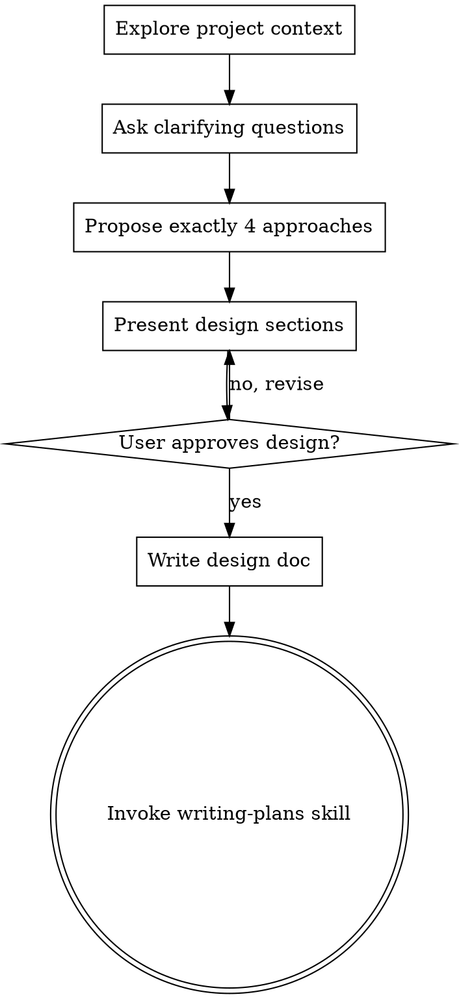

# Brainstorming Ideas Into Designs

## Overview

Help turn ideas into fully formed designs and specs through natural collaborative dialogue.

Start by understanding the current project context, then ask questions one at a time to refine the idea. Once you understand what you're building, present the design and get user approval.

## Session Map

Before asking the first question, declare the session structure upfront:

> This brainstorming session will take approximately **N questions** across these topics:
> ① [Topic A] → ② [Topic B] → ③ [Topic C] → ④ [Topic D]
> Current: Question X/N

Derive N and the topic list from the idea's complexity after exploring project context (Step 1). For a simple feature, N is typically 3–5; for a complex system, 6–8. State N honestly — do not compress to seem fast.

<HARD-GATE>
Do NOT invoke any implementation skill, write any code, scaffold any project, or take any implementation action until you have presented a design and the user has approved it. This applies to EVERY project regardless of perceived simplicity.
</HARD-GATE>

## Anti-Pattern: "This Is Too Simple To Need A Design"

Every project goes through this process. A todo list, a single-function utility, a config change — all of them. "Simple" projects are where unexamined assumptions cause the most wasted work. The design can be short (a few sentences for truly simple projects), but you MUST present it and get approval.

## Checklist

You MUST create a task for each of these items and complete them in order:

1. **Explore project context** — check files, docs, recent commits
2. **Ask clarifying questions** — one at a time, understand purpose/constraints/success criteria
3. **Propose exactly 4 approaches** — with trade-offs and your recommendation
4. **Present design** — in sections scaled to their complexity, get user approval after each section
5. **Write design doc** — save to `docs/drafts/YYYY-MM-DD-<topic>-design.md` and commit
6. **Transition to implementation** — invoke writing-plans skill to create implementation plan

## Process Flow



**The terminal state is invoking writing-plans.** Do NOT invoke frontend-design, mcp-builder, or any other implementation skill. The ONLY skill you invoke after brainstorming is writing-plans.

## The Process

**Understanding the idea:**
- Check out the current project state first (files, docs, recent commits)
- Ask questions one at a time to refine the idea
- Prefer multiple choice questions when possible, but open-ended is fine too
- Only one question per message — if a topic needs more exploration, break it into multiple questions
- **Every question must use the Question Card format** (see below)
- Focus on understanding: purpose, constraints, success criteria

**Exploring approaches:**
- Always propose exactly 4 approaches — this ensures divergent thinking
- Present using the Approach Comparison table:

| Approach | Core idea | Pros | Cons |
|----------|-----------|------|------|
| A. [name] | ... | ... | ... |
| B. [name] | ... | ... | ... |
| C. [name] | ... | ... | ... |
| D. [name] | ... | ... | ... |

> **Recommendation: [A / A+C combination / etc.]**
> Reasoning: [1–2 sentences explaining why single or combination is recommended]

**Presenting the design:**
- Once you believe you understand what you're building, present the design
- Scale each section to its complexity: a few sentences if straightforward, up to 200-300 words if nuanced
- Ask after each section whether it looks right so far
- Cover: architecture, components, data flow, error handling, testing
- Be ready to go back and clarify if something doesn't make sense

### Question Card Format

Every clarifying question must be rendered exactly as follows:

```
**Question X/N: [topic]**
Background: [1 sentence explaining why this information is needed]
Question: [the specific question]
Options:
  A. ...
  B. ...
  C. Other (please specify)
```
(omit Options if the answer space cannot be enumerated)

Rules:
- X/N must stay current across every message
- Background is mandatory — it shows the user why the question matters
- Options are preferred; each option on its own line; omit only when the answer space cannot be enumerated
- Keep each card to ≤ 5 lines visible to the user

### Batching Rule

**Default: one card per message.**

Exception — light batching (2–3 questions in one message) is allowed only when ALL of the following hold:
1. All questions are purely factual/context-gathering (e.g., "What stack are you on?", "Is there an existing auth system?")
2. None is a critical design decision (approach, architecture, trade-offs)
3. The total card count does not exceed 3

When batching, render each question as a separate numbered card. Critical decision questions are ALWAYS sent alone.

## After the Design

**Documentation:**
- Write the validated design to `docs/drafts/YYYY-MM-DD-<topic>-design.md`
- Use elements-of-style:writing-clearly-and-concisely skill if available
- Commit the design document to git

**Implementation:**
- Invoke the writing-plans skill to create a detailed implementation plan
- Do NOT invoke any other skill. writing-plans is the next step.

## Key Principles

- **Session map first** — Declare the total question count and topic agenda before asking anything
- **Question Card always** — Every question uses the fixed card format (X/N, Background, Question, Options each on own line)
- **One decision at a time** — Each critical design decision gets its own message; light factual batching (≤3) is the only exception
- **4 approaches always** — Always propose exactly 4 options to ensure divergent thinking; recommend single or combination with reasoning
- **Multiple choice preferred** — Easier to answer than open-ended when possible; options on separate lines
- **YAGNI ruthlessly** — Remove unnecessary features from all designs
- **Incremental validation** — Present design, get approval before moving on
- **Be flexible** — Go back and clarify when something doesn't make sense
