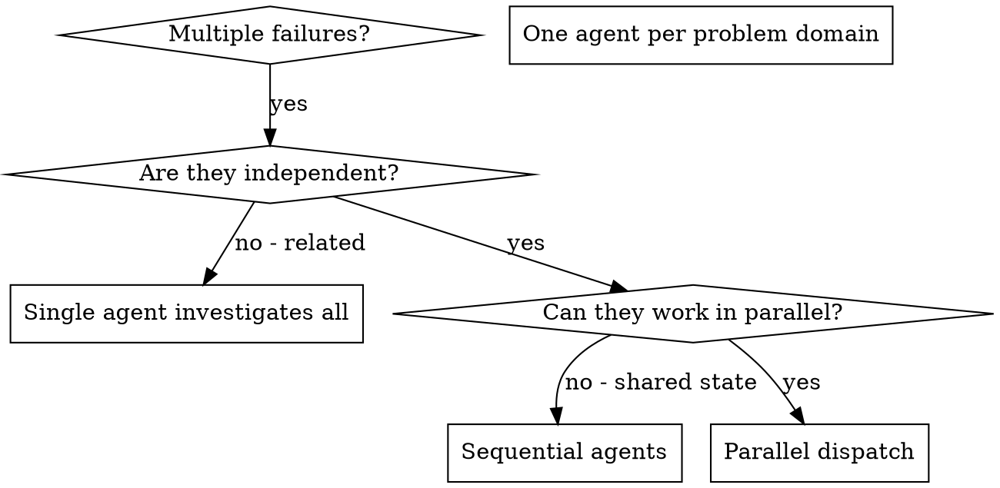

# 并行分发 Agent (Dispatching Parallel Agents)

## 概览 (Overview)

当你面对多个互不相关的失败（不同测试文件、不同子系统、不同 bug）时，按顺序逐个调查是在浪费时间。每个调查彼此独立，完全可以并行进行。

**核心原则：** 每个独立问题域（problem domain）派一个 agent。让它们并发工作。

## 何时使用 (When to Use)



**适用场景：**

- 3 个以上测试文件失败，且根因不同
- 多个子系统彼此独立地损坏
- 每个问题都能在不依赖其他问题上下文的前提下被理解
- 各调查之间没有共享状态

**不适用场景：**

- 失败之间相关，修一个可能顺带修另一个
- 必须先理解整套系统状态
- agents 会互相干扰

## 模式 (The Pattern)

### 1. 识别独立问题域 (Identify Independent Domains)

按“坏掉的是什么”给失败分组：

- File A tests：Tool approval flow
- File B tests：Batch completion behavior
- File C tests：Abort functionality

每个域都彼此独立，例如修 tool approval 不会影响 abort tests。

### 2. 为 Agent 设计聚焦任务 (Create Focused Agent Tasks)

每个 agent 都应拿到：

- **明确范围（Specific scope）**：一个测试文件或一个子系统
- **清晰目标（Clear goal）**：让这些测试通过
- **约束（Constraints）**：不要改其他代码
- **期望输出（Expected output）**：总结你发现了什么、修了什么

### 3. 并行分发 (Dispatch in Parallel)

```typescript
// In Claude Code / AI environment
Task("Fix agent-tool-abort.test.ts failures")
Task("Fix batch-completion-behavior.test.ts failures")
Task("Fix tool-approval-race-conditions.test.ts failures")
// All three run concurrently
```

### 4. 评审并集成 (Review and Integrate)

当 agents 返回后：

- 读取每份总结
- 验证修复之间不冲突
- 跑完整测试套件
- 集成全部修改

## Agent Prompt 结构 (Agent Prompt Structure)

好的 agent prompt 应满足：

1. **聚焦（Focused）**：只围绕一个清晰问题域
2. **自包含（Self-contained）**：具备理解问题所需的全部上下文
3. **明确输出（Specific about output）**：说明 agent 该返回什么

```markdown
Fix the 3 failing tests in src/agents/agent-tool-abort.test.ts:

1. "should abort tool with partial output capture" - expects 'interrupted at' in message
2. "should handle mixed completed and aborted tools" - fast tool aborted instead of completed
3. "should properly track pendingToolCount" - expects 3 results but gets 0

These are timing/race condition issues. Your task:

1. Read the test file and understand what each test verifies
2. Identify root cause - timing issues or actual bugs?
3. Fix by:
   - Replacing arbitrary timeouts with event-based waiting
   - Fixing bugs in abort implementation if found
   - Adjusting test expectations if testing changed behavior

Do NOT just increase timeouts - find the real issue.

Return: Summary of what you found and what you fixed.
```

## 常见错误 (Common Mistakes)

**❌ 太宽泛：** “Fix all the tests” → agent 容易迷失  
**✅ 更好：** “Fix agent-tool-abort.test.ts” → 范围聚焦

**❌ 没有上下文：** “Fix the race condition” → agent 不知道在哪  
**✅ 更好：** 把错误信息和测试名贴出来

**❌ 没有约束：** agent 可能把所有东西都重构了  
**✅ 更好：** “Do NOT change production code” 或 “Fix tests only”

**❌ 输出模糊：** “Fix it” → 你无法判断改了什么  
**✅ 更好：** “Return summary of root cause and changes”

## 什么时候不要用 (When NOT to Use)

**相关失败：** 修复一个可能顺带修掉其他问题，应先一起调查  
**需要完整上下文：** 必须先看全系统才能理解  
**探索式调试：** 你甚至还不知道到底坏了什么  
**共享状态：** agents 会互相影响，例如改同一文件、争同一资源

## 真实示例 (Real Example from Session)

**场景：** 一次大重构后，3 个文件中共有 6 个测试失败

**失败分布：**

- `agent-tool-abort.test.ts`：3 个失败（timing issues）
- `batch-completion-behavior.test.ts`：2 个失败（tools not executing）
- `tool-approval-race-conditions.test.ts`：1 个失败（execution count = 0）

**判断：** 这些属于独立问题域，abort logic、batch completion 与 race conditions 彼此分离

**分发：**

```
Agent 1 → Fix agent-tool-abort.test.ts
Agent 2 → Fix batch-completion-behavior.test.ts
Agent 3 → Fix tool-approval-race-conditions.test.ts
```

**结果：**

- Agent 1：把 timeout 替换为 event-based waiting
- Agent 2：修复事件结构 bug（`threadId` 放错位置）
- Agent 3：增加等待，确保异步 tool execution 完成

**集成：** 所有修复彼此独立、没有冲突，完整套件转绿

**节省时间：** 3 个问题并行解决，而不是串行处理

## 关键收益 (Key Benefits)

1. **并行化（Parallelization）**：多个调查可同时进行
2. **聚焦（Focus）**：每个 agent 的上下文更窄，更容易把握
3. **独立性（Independence）**：agents 彼此不干扰
4. **速度（Speed）**：3 个问题在接近 1 个问题的时间里解决

## 验证 (Verification)

在 agents 返回后：

1. **Review each summary**：确认每个 agent 实际改了什么
2. **Check for conflicts**：检查是否改到同一处代码
3. **Run full suite**：验证所有修复组合在一起仍然成立
4. **Spot check**：agents 也可能犯系统性错误

## 真实影响 (Real-World Impact)

来自 2025-10-03 的一次调试会话：

- 3 个文件里有 6 个失败
- 并行分发了 3 个 agent
- 所有调查并发完成
- 所有修复成功集成
- agent 之间零冲突
