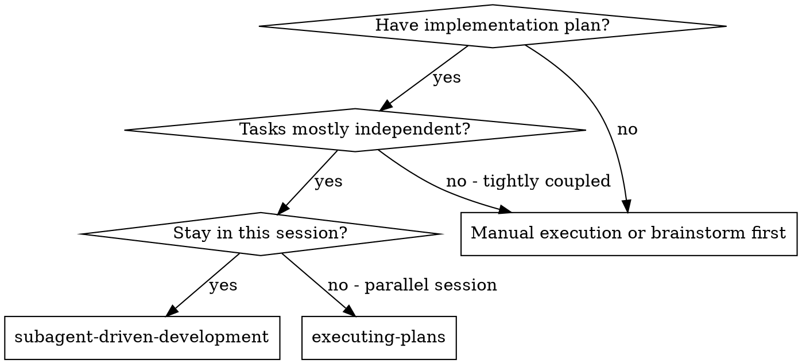
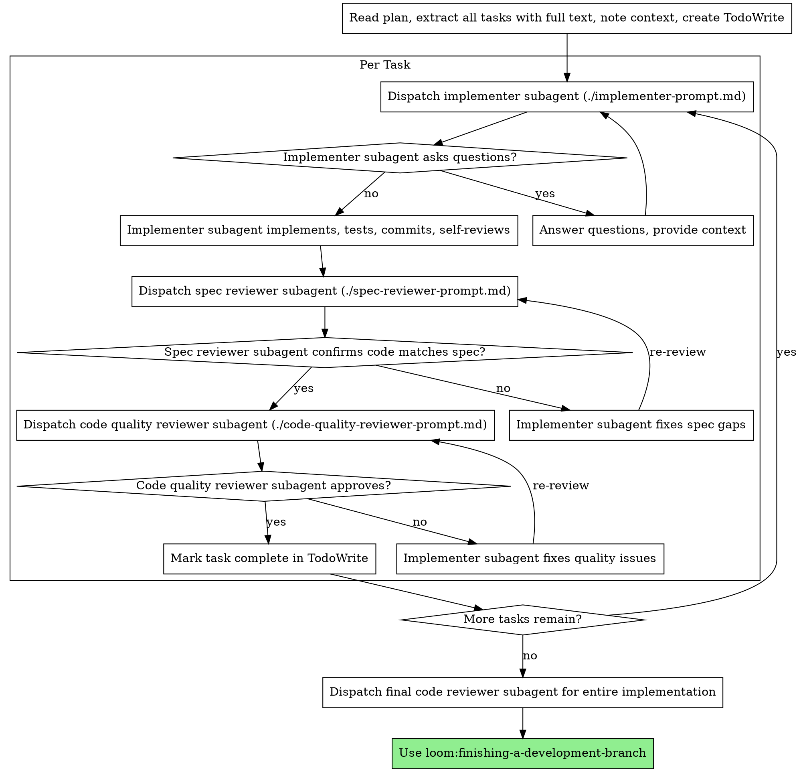

# Subagent 驱动开发 (Subagent-Driven Development)

通过“每个任务分发一个全新的 subagent”的方式执行计划，并在每个任务后做两阶段评审：先检查 spec compliance，再检查 code quality。

**核心原则：** 每个任务一个新 subagent + 两阶段评审（先规格、后质量）= 更高质量、更快迭代

## 何时使用 (When to Use)

**相对于 `executing-plans`（平行会话）的优势：**

- 同一会话内完成，无需上下文切换
- 每个任务都用全新的 subagent，避免上下文污染
- 每个任务后都做两阶段评审：先规格一致性，再代码质量
- 迭代更快，不需要在任务之间等待人工插入反馈

## 过程 (The Process)

## Prompt 模板 (Prompt Templates)

- `./implementer-prompt.md` - 实现 subagent 模板
- `./spec-reviewer-prompt.md` - 规格一致性 reviewer 模板
- `./code-quality-reviewer-prompt.md` - 代码质量 reviewer 模板

## 示例工作流 (Example Workflow)

原始示例保留不变，用于说明 controller、implementer 与 reviewer 的协作顺序与 review loop。

## 优势 (Advantages)

**相对于手工执行：**

- subagents 天然更容易遵循 TDD
- 每个任务是新上下文，混淆更少
- 并行安全，subagents 之间不会互相干扰
- subagent 可以在开始前和过程中都提问题

**相对于 `executing-plans`：**

- 保持在同一会话中
- 可以持续前进，不必在每个任务间等待
- review checkpoint 自动发生

**效率收益：**

- 控制器直接提供完整任务文本，省去 file reading 开销
- 控制器只给出真正需要的上下文
- subagent 从一开始就拿到完整信息
- 问题会在开工前暴露，而不是做完后才发现

**质量门：**

- self-review 会在 handoff 前先拦一层
- 两阶段评审：先 spec compliance，再 code quality
- review loop 确保修复真正到位
- spec compliance 防止 over-building / under-building
- code quality 保证实现本身过硬

**成本：**

- subagent 调用次数更多（每任务 1 个 implementer + 2 个 reviewer）
- controller 前期准备更多（一次性提取全部任务）
- review loop 会增加迭代次数
- 但它会更早发现问题，整体比后期返工便宜

## 红旗信号 (Red Flags)

**绝不要：**

- 未经用户明确同意就在 `main/master` 上开工
- 跳过任一 review（spec compliance 或 code quality）
- 带着未修复问题继续
- 并行分发多个 implementer subagent（容易冲突）
- 让 subagent 自己读 plan file（应直接提供完整任务文本）
- 省略 scene-setting context（subagent 需要知道任务放在哪个位置）
- 忽略 subagent 提问（先回答，再让它继续）
- 对 spec compliance 采取“差不多就行”的态度
- 跳过 review loop（reviewer 发现问题 → implementer 修 → reviewer 复审）
- 用 implementer 的 self-review 代替正式 review
- **在 spec compliance 还没 ✅ 前就开始 code quality review**
- 当任一 review 仍有 open issues 时就切到下一个任务

**如果 subagent 提问：**

- 清楚完整地回答
- 必要时补充上下文
- 不要催它直接开干

**如果 reviewer 发现问题：**

- 由同一个 implementer subagent 修复
- reviewer 再次评审
- 重复，直到通过
- 不要跳过复审

**如果 subagent 任务失败：**

- 分发一个 fix subagent，并给出具体修复指令
- 不要改成自己手工补（避免上下文污染）

## 集成关系 (Integration)

**必需工作流技能：**

- **`loom:using-git-worktrees`** - 必需：开始前建立隔离工作区
- **`loom:writing-plans`** - 生成待执行计划
- **`loom:requesting-code-review`** - reviewer subagent 的 code review 模板
- **`loom:finishing-a-development-branch`** - 所有任务完成后收尾

**subagents 应使用：**

- **`loom:test-driven-development`** - 每个任务遵循 TDD

**替代工作流：**

- **`loom:executing-plans`** - 如果要在并行会话中执行，而不是当前会话内执行
