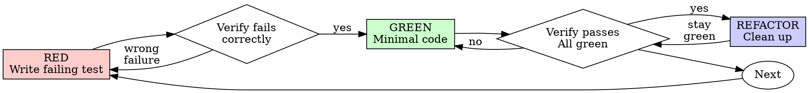

# 测试驱动开发 (Test-Driven Development, TDD)

## 概览 (Overview)

先写测试。看它失败。再写最小代码让它通过。

**核心原则：** 如果你没亲眼看见测试先失败，你就无法确认它测的是对的东西。

**只守字面、不守精神，也一样算违背规则。**

## 何时使用 (When to Use)

**一律适用：**

- 新功能
- Bug 修复
- 重构
- 行为变更

**例外（先问你的人类协作者）：**

- 一次性原型
- 生成代码
- 配置文件

只要你心里冒出“这次先跳过 TDD 吧”，那就是在自我合理化。

## 铁律 (The Iron Law)

```
NO PRODUCTION CODE WITHOUT A FAILING TEST FIRST
```

先写了代码、后写测试？删掉。重来。

**没有例外：**

- 不要把旧代码留着当“参考”
- 不要边写测试边“顺手改一下”
- 不要继续看它
- Delete 就是真的 delete

必须从测试重新实现。没有讨价还价空间。

## 红-绿-重构 (Red-Green-Refactor)



### RED：写失败测试 (Write Failing Test)

写一个最小测试，表达“它应该怎样工作”。

要求：

- 只测一个行为
- 名称清晰
- 尽量使用真实代码，而不是 mock

### 验证 RED：亲眼看它失败 (Verify RED)

**强制要求，不能跳。**

```bash
npm test path/to/test.test.ts
```

确认：

- 测试是失败，不是报错
- 失败信息符合预期
- 失败是因为功能缺失，而不是拼写错误或测试写坏

测试直接通过？那你测的是现有行为，不是新需求。重写测试。

### GREEN：最小实现 (Minimal Code)

写出让测试通过的最简单代码。

不要额外加功能、顺手重构其他地方，或做超出测试要求的“优化”。

### 验证 GREEN：亲眼看它通过 (Verify GREEN)

**强制要求。**

```bash
npm test path/to/test.test.ts
```

确认：

- 当前测试通过
- 其他测试仍然通过
- 输出干净，没有错误或 warning

### REFACTOR：清理 (Clean Up)

只有在 green 之后才做：

- 去重
- 改好名字
- 抽 helper

但不能新增行为。

### Repeat：进入下一个测试

下一个功能，就写下一个失败测试。

## 好测试的标准 (Good Tests)

| 维度（Quality） | 好（Good） | 坏（Bad） |
|---------|------|-----|
| **Minimal** | 只测一件事；测试名里有 `and` 就该拆开 | `test('validates email and domain and whitespace')` |
| **Clear** | 名称直接描述行为 | `test('test1')` |
| **Shows intent** | 体现期望 API 与行为 | 让人看不出代码该怎么用 |

## 为什么顺序重要 (Why Order Matters)

“我先写代码，之后再补测试验证它”

这在逻辑上不成立。因为测试在代码之后写出来时，往往会**立刻通过**；而“立刻通过”证明不了任何事：

- 你可能测错了东西
- 你测的是实现细节，不是行为
- 你可能漏掉了边界情况
- 你从没见过这个测试真的抓住 bug

测试先行，迫使你先看见失败，才能证明这个测试真的在测东西。

“我已经手工测过所有边界情况了”

手工测试是 ad-hoc 的：

- 没有记录
- 代码一改就得重来
- 压力下最容易漏 case
- “我手动试过一次能跑” 远远不等于系统性验证

自动化测试才是可重复、可回归、可累积的。

## 常见自我合理化 (Common Rationalizations)

| 借口（Excuse） | 现实（Reality） |
|--------|---------|
| “太简单了，不值得写测试” | 简单代码一样会坏；测试只要几十秒。 |
| “我之后补测试” | 立即通过的测试证明不了任何事。 |
| “事后写测试效果一样” | 事后测试回答“它做了什么”；TDD 回答“它本该做什么”。 |
| “我已经手工测过了” | Ad-hoc 不等于系统化。 |
| “删掉几小时工作太浪费” | 沉没成本。留下不可信代码才是真浪费。 |
| “我保留着代码当参考，再先写测试” | 你一定会不自觉适配它。那仍然是 tests-after。 |
| “我需要先探索一下” | 可以探索，但探索完要扔掉，再从 TDD 正式开始。 |
| “测试很难写，说明设计不清” | 正是如此。难测就该简化设计。 |
| “TDD 会拖慢我” | TDD 比后期 debug 更快。 |
| “手工试更快” | 手工无法稳定覆盖边界情况。 |
| “老代码本来就没测试” | 那你现在正是在改善它。 |

## 红旗信号：立刻停下并重来 (Red Flags)

- 代码在测试之前
- 实现完才补测试
- 测试一上来就通过
- 你说不清测试为什么失败
- 打算“之后再补测试”
- 心里在说“就这一次”
- “我已经手工测过了”
- “tests-after 其实也一样”
- “重点是 spirit，不是 ritual”
- “先留着当参考”
- “已经花了 X 小时，删掉太亏”
- “TDD 太教条，我要 pragmatic 一点”
- “这次情况不一样”

**出现这些信号，说明你应该删掉代码，按 TDD 重来。**

## 示例：修 Bug (Example: Bug Fix)

**Bug：** 空 email 被接受

**RED**
```typescript
test('rejects empty email', async () => {
  const result = await submitForm({ email: '' });
  expect(result.error).toBe('Email required');
});
```

**Verify RED**
```bash
$ npm test
FAIL: expected 'Email required', got undefined
```

**GREEN**
```typescript
function submitForm(data: FormData) {
  if (!data.email?.trim()) {
    return { error: 'Email required' };
  }
  // ...
}
```

**Verify GREEN**
```bash
$ npm test
PASS
```

**REFACTOR**
如果后续多个字段都要校验，再抽出 validation。

## 验证清单 (Verification Checklist)

在声称工作完成前，确认：

- [ ] 每个新函数/方法都有测试
- [ ] 每个测试都先亲眼看过失败
- [ ] 每个测试都是因为预期原因失败，而不是 typo
- [ ] 代码是以最小实现方式写出来的
- [ ] 全部测试通过
- [ ] 输出干净，没有错误与 warning
- [ ] 测试尽量使用真实代码
- [ ] 边界情况与错误路径都有覆盖

有任何一项打不了勾，就说明你跳过了 TDD。

## 卡住时怎么办 (When Stuck)

| 问题（Problem） | 处理方式（Solution） |
|---------|----------|
| 不知道怎么测 | 先写出你希望存在的 API，再写断言；必要时问你的人类协作者。 |
| 测试太复杂 | 说明设计太复杂，先简化接口。 |
| 什么都得 mock | 说明耦合太重，考虑依赖注入。 |
| 测试 setup 太大 | 先抽 helper；如果仍然巨大，说明设计需要简化。 |

## 与 Debugging 的关系 (Debugging Integration)

发现 bug？先写一个能稳定复现它的失败测试，然后走完整个 TDD 循环。测试既证明修复有效，也防止回归。

绝不要在没有测试的情况下修 bug。

## 测试反模式 (Testing Anti-Patterns)

当你要引入 mocks 或测试工具时，先读 `testing-anti-patterns.md`，避免常见陷阱：

- 测的是 mock 行为，不是真实行为
- 给生产类加 test-only 方法
- 在不了解依赖时盲目 mock

## 最终规则 (Final Rule)

```
Production code → test exists and failed first
Otherwise → not TDD
```

除非你的人类协作者明确许可，否则没有例外。
